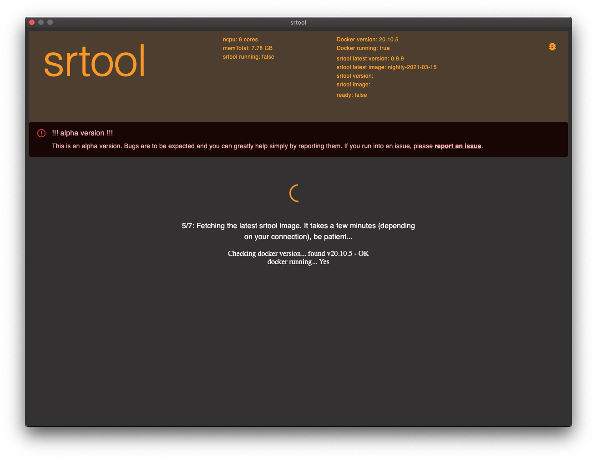
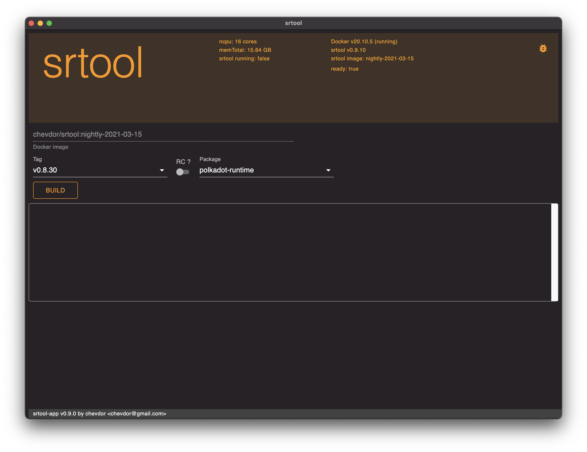
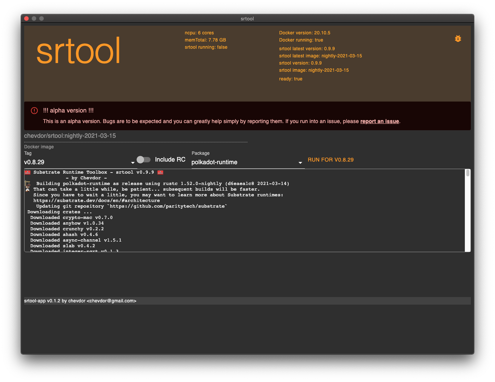
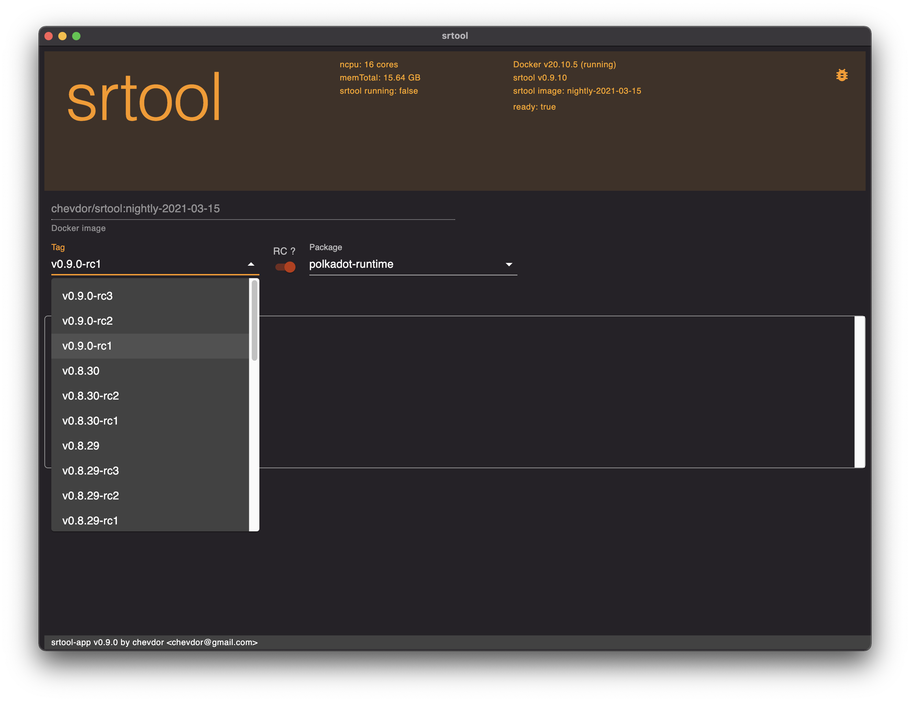

= srtool app
:toc: right
:prj: Srtool App

This application is a multi-platform frontend for the https://gitlab.com/chevdor/srtool[srtool] project.

It takes care of fetching the latest docker image for you:

It builds your WASM runtime:

It shows you the proposal hash and allows you to easily share your results:

include::doc/usage.adoc[leveloffset=+1]

include::TODO.adoc[leveloffset=+1]
