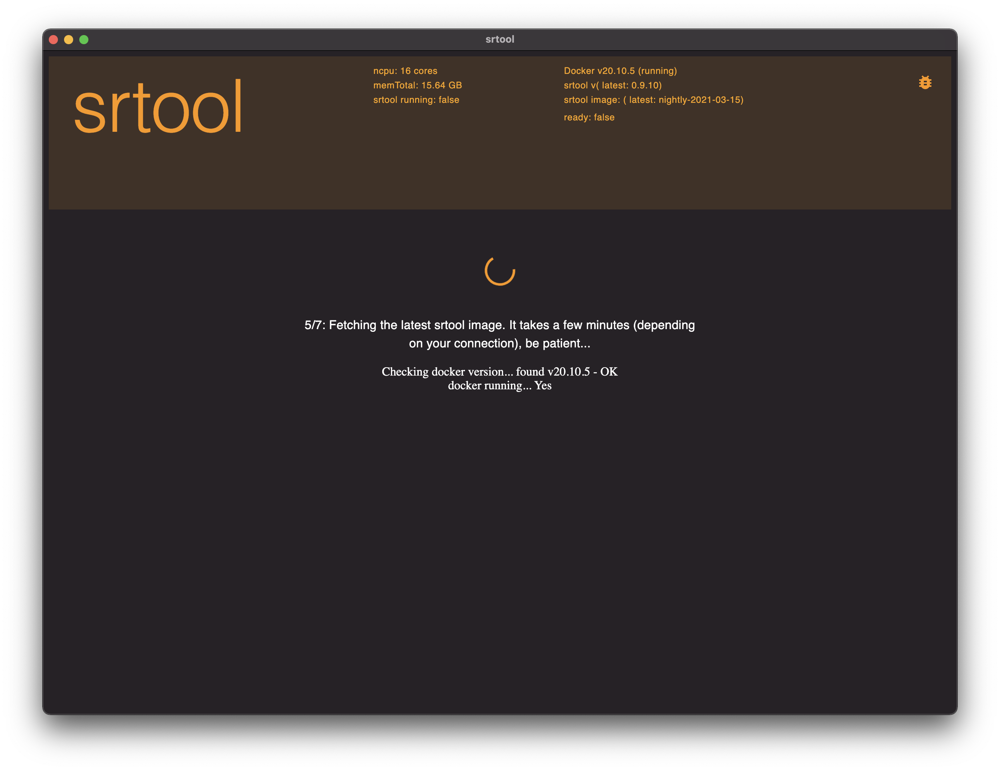

= srtool app
:toc: right
:prj: Srtool App

== Introduction
This application is a multi-platform frontend for the https://gitlab.com/chevdor/srtool[srtool] project. In a nutshell, it remote controls your docker environment to allow building a Substrate based chain easily.

IMPORTANT: Docker is a mandatory pre-requisite. It must be installed and running. You do not need any knowledge of Docker however and you will not need to do anything about it, once setup properly (Windows users need to go through a few extra steps)

Using {prj} and `srtool`, you do not need anything but Docker installed on your system.

You do NOT need the following

- the Rust programming language & compiler
- git
- the source

== Screenshots

[cols="1,1"]
|===
2+| At start, {prj} is performing a few version checks and will download the latest `srtool` docker image. This may take a few minutes and you need to be patient :)

|
image:resources/ss02.png[title="You can select the chain and version to build"]

|
image:resources/ss03.png[title="Selectzing the version"]

|

|

|

|

2+|

|===

include::doc/usage.adoc[leveloffset=+1]

== License
----
include::LICENSE[]
----